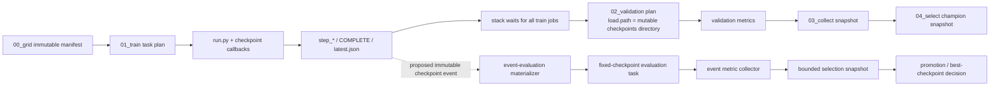

# Dynamic Checkpoint Evaluation and Metric-Best Selection

> **Status:** discussion record, 2026-07-11. Define serializable contracts and
> pure policy interfaces now; defer dynamic scheduling/runtime integration.
> **Scope:** future v4 experiment stack only. Do not alter the live v3
> `train → validate → collect → select` path while deciding this.
>
> **Superseded for implementation, 2026-07-24:** ownership and corrected
> contract decisions now live in
> [`.planning/checkpoint-selection-boundary-decision.md`](../.planning/checkpoint-selection-boundary-decision.md).
> Future implementers must use
> [`.planning/checkpoint-selection-implementation-instructions.md`](../.planning/checkpoint-selection-implementation-instructions.md).
> Options below remain design history and evidence; proposals for a core
> publisher, mutable record state, or immediate runtime scheduling are not
> accepted implementation instructions.
>
> **Related:**
> [`toolkit-roadmap.md`](toolkit-roadmap.md) is the canonical v4 plan;
> [issue #113](https://github.com/YizhongHu/SpENN/issues/113) is the refactoring
> manifesto. Any accepted design must preserve the manifesto's planning /
> execution / run ownership split and pass the frozen-v3-smoke E2E gate.

## Recorded design constraints

| ID | Decision | Required consequence |
| --- | --- | --- |
| D1 | Every **published** checkpoint is a candidate. | “Published” is a fixed, persisted per-batch checkpoint schedule, not every optimizer step. |
| D2 | The selector sees every terminal candidate in an optimizer-initiated batch before choosing. | No result-arrival-order selection; the batch closes only after every published candidate has a terminal evaluation outcome. |
| D3 | The optimizer advances in batches. | `SearchStrategy.ask` opens a batch; `tell` happens only after its selection/objective snapshot closes; then the next batch may begin. |
| D4 | Selected candidate(s) must remain available with JSONL-backed references. | Retain every candidate payload through batch selection; physically pin selected candidates; periodically prune only terminal, non-selected payloads and append the prune outcome. |
| D5 | The default objective vector minimizes energy and local-energy variance. | Support one, top-K, or Pareto selected candidates; aggregation, constraints, scalarization, and deterministic tie-breaks remain configured policy. |
| D6 | Acceptance E2E uses test partitions; full science uses production partitions. | Use `test`/`gpu_test` for v3→v4 smoke evidence; use non-test CPU/GPU partitions for full batches and retain the exact execution profile as provenance. |

### Explicitly still undecided

- Does a narrow core `CheckpointPublished` plus physical retention/pin primitive
  provide the right generic boundary, with all batch/evaluation/selector/Optuna
  policy in `experiments/`?
- Is the first selector per run, per trial across seed replicas, or batch-global?
- Does the default energy/variance policy retain a Pareto front, top-K
  representatives, or a reviewed scalarized winner?
- What fixed checkpoint schedule, candidate cap, and storage backpressure rule
  make the batch tractable?
- How do failed or unavailable evaluations affect batch closure?

## The question

We want to identify a scientifically best checkpoint while training is still in
progress. The current v3 stack deliberately makes that hard:

```text
plan all training
  → wait for all training
  → plan all validation
  → collect one validation result per planned run
  → select champions from a stable collection snapshot
```

That barrier is safe and reproducible, but it delays feedback until training has
finished. A dynamic design can improve utilization and enable early promotion,
pruning, or final-checkpoint choice. It also introduces three risks:

1. a mutable `latest.json` pointer can change between planning and evaluation;
2. result arrival order can accidentally become a scientific selection policy;
3. checkpoint retention can delete an event's checkpoint before an evaluator
   claims it.

The design decision is therefore two-dimensional:

```text
Who owns a checkpoint fact and its integrity?      core run layer
Who owns evaluation scheduling and metric-best choice?  experiment stack
```

## Observed v3 boundary



### Current ownership and constraints

| Current owner | Current behavior | Dynamic-design consequence |
| --- | --- | --- |
| `run.py` checkpoint callback | Publishes `checkpoints/step_*`, `COMPLETE`, and `checkpoints/latest.json`. | It is the only correct producer of checkpoint bytes and completeness evidence. |
| `train.py` + executor | Materializes one fixed-grid train task per planned run and treats completed status plus `latest.json` as task completion. | It is not a checkpoint stream or an evaluation scheduler. |
| `validate.py` | Selects a train attempt explicitly or through a mutable run-level latest pointer; checks only that `checkpoints/latest.json` exists; passes the checkpoint directory as `load.path`. | Concurrent evaluation can race with pointer movement and retention. |
| `collect.py` | Takes the latest validation attempt for each planned run and emits one stable summary snapshot. | It is not an event log; changing its population would break parity semantics. |
| `select_champions.py` | Aggregates completed seed rows and writes a reproducible champion snapshot. | It should remain a snapshot policy, not become a polling loop. |
| `submit_stack.sh` | Waits between full stages and enforces expected row counts. | It intentionally prevents concurrent train/eval in the v3 reference path. |
| `task_state.py` / executor claims | Atomically claim one planned task row and permit specified reclaim behavior. | It does not yet define checkpoint-event identity, cursoring, or event-evaluation idempotency. |

The current final path has a useful stronger checkpoint identity contract:
final evaluation resolves a selected checkpoint only when pointer, concrete
directory, `COMPLETE`, and checkpoint manifest agree. That is stronger than
scan validation's pointer-only readiness. These existing predicates must remain
distinct; a dynamic event contract must be additive rather than a generic
replacement.

## Industry pattern

There are two common layers, not one universal owner.

### 1. Run-local checkpointing belongs in the training framework

Training frameworks commonly save a run-local “best” checkpoint from a metric
that is already available inside that run. For example, Lightning's
`ModelCheckpoint` monitors a logged metric and exposes `best_model_path` and
`best_model_score` after training. This is appropriate when the monitored
validation metric is part of the trainer's own loop.

It is **not** sufficient here if “best” means an external scientific evaluation
suite, cross-seed aggregate, multi-objective metric, or a selection policy that
requires separate Slurm jobs.

### 2. Cross-trial allocation belongs in an experiment controller

Hyperparameter-optimization systems keep global resource allocation outside a
single trainer:

- Optuna has iterative code report intermediate values and ask a pruning policy
  whether to stop a trial.
- Ray Tune's ASHA scheduler uses an increasing progress attribute, a metric,
  a grace period, and a reduction factor to stop or promote trials without
  waiting for all stragglers.
- Synchronous successive halving uses the same resource-rung idea but waits for
  a cohort before promoting a deterministic top fraction.

Those systems make checkpoint/report events available to a controller, while
trainers remain responsible for producing resumable state. The controller owns
resource allocation and selection policy.

### Consequence for SpENN

The industry-aligned split is **hybrid**:

| Core `spenn` run layer should own | Experiment stack should own |
| --- | --- |
| Atomic checkpoint publication after a concrete checkpoint is complete. | Which checkpoints are evaluated, when, and with which evaluation suite. |
| Generic checkpoint identity: run/attempt, step, concrete directory, manifest digest, checkpoint schema/version. | Dynamic task materialization, executor/backend choice, worker claims, concurrency limits, and retries. |
| Generic callback/hook that can emit a durable checkpoint-publication artifact. | Event-level metric collection, aggregation across seeds, objective/uncertainty policy, and metric-best selection. |
| Generic retention/pin capability or an explicit retention outcome. | `selected_checkpoint` / promotion snapshot that references a completed evaluation event. |
| Generic restore/load semantics. | Slurm/Submitit/local routing, stage watermarks, and stop/continue decisions. |

The core package must **not** import experiment policy, know Slurm, rank
scientific candidates, or decide a cross-trial winner. Conversely, experiment
code should consume a stable JSON artifact rather than import a trainer object;
this preserves the `experiments/` boundary.

## Ownership options

### Option A — Keep post-training validation only

Train complete runs as today, then evaluate one or more retained checkpoints in
a separate batch and choose the best afterward.

| Pros | Cons |
| --- | --- |
| Lowest risk; preserves v3-like stage boundaries and parity. | No on-the-fly feedback or early resource recovery. |
| No concurrent train/eval control plane. | All candidates train to the full budget even if clearly poor. |
| Existing executor, collection, and selector concepts mostly apply. | Retaining/evaluating many checkpoints can cost storage and evaluation time. |

**Ownership:** experiment only; no core extension required beyond existing
checkpoint retention settings.

**Use when:** the main goal is final checkpoint quality, not adaptive budget
allocation.

### Option B — Core-only run-local `best_checkpoint` callback

Add a generic callback that ranks checkpoints using a metric produced inside the
training run and writes a best-checkpoint pointer.

| Pros | Cons |
| --- | --- |
| Familiar framework pattern; small core API. | Cannot use external validation, cross-seed uncertainty, or experiment-level objective. |
| Useful independently for any SpENN run with an in-process validation metric. | A generic “best” name would be misleading if the scientific metric lives in a separate evaluation stage. |
| Avoids a queue/controller. | Does not solve dynamic work assignment or resource allocation. |

**Ownership:** core.

**Use when:** “best” really means a single run's trainer-visible metric. This
is a valuable primitive, but it should not be the primary answer to the current
experiment-stack problem.

### Option C — Future hybrid, optimizer-initiated batch checkpoint selection

This remains the preferred **future behavior**, not work to implement now. The
search strategy would ask for a bounded batch of trials; each trial would
publish scheduled checkpoint candidates; later evaluators could consume those
candidates concurrently. The batch would not ask for more trials or choose a
checkpoint as results arrive. It would close only after every published
candidate had a terminal evaluation result, then a selector would see the whole
immutable batch snapshot and emit one or more selected checkpoint refs.

| Pros | Cons |
| --- | --- |
| It evaluates checkpoints on the fly without making training/evaluation one process. | It requires event-level evaluation tasks, batch closure state, retention, and explicit storage backpressure. |
| Batch membership and selector inputs are deterministic, so Optuna and multi-objective policies receive a replayable snapshot. | Selected candidate payloads and all pre-selection candidates need retention until batch closure. |
| Evaluation can overlap training, while next-batch optimizer decisions remain barriered and reproducible. | It does not reclaim training budget early; all batch runs complete their configured budget. |
| It supports one winner or a Pareto set without making the first-completed metric decisive. | It does not yet deliver ASHA-style early pruning/promotion. |

**Ownership:** proposed hybrid. Core would publish generic checkpoint facts; v4
would own batch identity, candidate/evaluation tasks, aggregation, selector
policy, optimizer `tell`, and execution.

**Current action:** define the data and policy interfaces below, but do not add
an event poller, dynamic worker loop, controller service, or runtime task
materializer.

### Option D — Hybrid, bounded-lag asynchronous evaluator

Trainers publish checkpoint events continuously. Independent evaluators claim
events while training continues. A controller limits unresolved events per
trial/cohort, snapshots decisions at deterministic windows, and throttles or
pauses training only at safe checkpoint boundaries.

| Pros | Cons |
| --- | --- |
| Better cluster utilization; evaluation overlaps training. | Requires an explicit durable event queue, cursor/watermark, idempotent task identities, leases, and retention pins. |
| Faster feedback than a full cohort barrier. | Arrival order and stale results can bias decisions unless selection windows are fixed. |
| Natural path toward an asynchronous experiment controller. | Harder E2E parity, restart, failure, and backfill story. |

**Ownership:** hybrid, with a real experiment-level control plane.

**Minimum safeguards:** `max_pending_evaluations`, a fixed decision window,
explicit “checkpoint pruned before evaluation” terminal result, single-writer
selection snapshots, and no fallback from a missing checkpoint to a newer
`latest.json` target.

**Use when:** Option C's barriers demonstrably waste enough capacity to justify
stateful asynchronous machinery.

### Option E — Full ASHA / Hyperband / PBT-style controller

Use asynchronous resource allocation to stop, promote, or mutate trials based
on intermediate reports.

| Pros | Cons |
| --- | --- |
| Highest potential resource efficiency for large searches. | Largest reproducibility and control-plane cost. |
| Established HPO pattern for allocation under heterogeneous trial durations. | Arrival-order effects, bracket/policy state, and adaptive population changes make parity much harder. |
| Can later sit behind the proposed `SearchStrategy` interface. | Out of scope for the fixed-grid v4 foundation; adding Optuna/Ray is a separate dependency/platform decision. |

**Ownership:** experiment controller, never the core package.

**Recommendation:** defer. Do not use ASHA/PBT as the first way to solve
checkpoint selection.

## Interface-first recommendation

Do not implement optimizer batches, dynamic event consumption, concurrent
checkpoint evaluation, or pruning now. Instead, make the eventual batch
workflow possible by defining stable contracts and pure policy boundaries:

```text
future behavior:
SearchStrategy.ask(batch_size)
  → RunBatch / checkpoint candidate facts
  → future evaluation planner and executor
  → CheckpointSelectionSnapshot
  → ObjectiveReducer
  → SearchStrategy.tell(...)

now:
serializable records + validation + pure selectors/reducers + retention intent
```

The proposed ownership split remains:

```text
core:       publish and retain trustworthy generic checkpoint facts
experiment: declare batches/evaluation specs, aggregate/select, later schedule
```

### Selector and Optuna interface boundary

Do not make `SearchStrategy`, `Objective`, and `Selector` aliases for one
another.

1. `CheckpointSelector` should be a pure policy over a complete immutable
   candidate snapshot. It returns one checkpoint, top-K checkpoints, or a
   Pareto set plus explanation/tie-break trace.
2. `ObjectiveReducer` should be a pure policy that turns selected checkpoint
   evaluation results into one objective vector per trial, for example
   `(energy, local_energy_variance)` in minimize/minimize order.
3. `SearchStrategy.tell` must accept complete trial results. A future
   `OptunaStrategy` can own the next `ask`, trial refs, directions, and Pareto
   state without reading a live checkpoint queue.
4. An optional future Optuna selector adapter must consume the same frozen
   snapshot and record study revision, trial refs, directions, and policy
   digest. It must not become an implicit live scheduler.

### Interfaces to add before scheduling is implemented

Define these records/protocols in the appropriate future contract slice, with
round-trip and validation tests but no runtime controller:

| Interface | Owner | Purpose now |
| --- | --- | --- |
| `CheckpointPublished` / immutable `CheckpointRef` | proposed core | Represent one complete concrete checkpoint, never a mutable `latest.json` directory. |
| `CheckpointRetentionIntent` / `CheckpointPin` | proposed core | Express `retain`, `release`, and physical pin provenance without deciding when a scheduler calls them. |
| `RunBatch` | experiment | Freeze proposed trials, checkpoint schedule, evaluator/objective/selector digests, and execution profile. |
| `CheckpointCandidateRef` | experiment | Tie a published checkpoint to batch/trial/seed identity and future selection retention. |
| `CheckpointEvaluationSpec` and `CheckpointEvaluationResult` | experiment | Describe evaluator version and compact terminal metrics independent of task dispatch. |
| `CheckpointSelector` | experiment | Pure batch-snapshot-to-selected-candidate policy. |
| `ObjectiveReducer` | experiment | Pure selected-results-to-trial-objective-vector policy for `SearchStrategy.tell`. |
| `CheckpointSelectionSnapshot` | experiment | Durable, replayable decision record with candidate inputs, policy digests, selected refs, and tie-break trace. |

Deliberately **do not** define a generic queue, scheduler, worker-pool, lease,
cursor, polling service, or database abstraction yet. Those operational
interfaces depend on real throughput/failure evidence and would be speculative
abstractions today.

## Proposed durable contracts

These are the interface-first discussion contracts. They may be implemented as
serializable data/policy objects before any dynamic scheduling exists.

### `RunBatch`

Created by the search strategy and closed before its next `ask`:

```text
batch_id
strategy_snapshot_ref
trial_ids / seed-policy digest
checkpoint_schedule_digest
evaluator_spec_digest
objective_spec_digest
selection_policy_digest
execution_profile
status = open | closing | closed
```

The checkpoint schedule is fixed once a batch opens. It defines the published
candidate population and prevents a run-time retention decision from silently
changing what the selector sees.

### `CheckpointPublished`

Published once, append-only, only after a concrete checkpoint directory is
complete:

```text
schema_version
checkpoint_event_id
batch_id
trial_id / seed_id / run_id / train_attempt_id / train_task_id
step
checkpoint_dir                 # concrete step_* path, never just checkpoints/
checkpoint_manifest_digest
checkpoint_schema_version
published_at
train_config_digest
pointer_snapshot                # informational, not the identity
retention_state                 # pending_evaluation | pinned | pruned
```

Identity derives from immutable facts, for example the batch/trial/seed/task id,
concrete checkpoint directory/step, manifest digest, and event-schema version.

### `CheckpointEvaluationTask`

Future dynamic materialization may derive this from one checkpoint event and one
evaluator version:

```text
evaluation_task_id = hash(checkpoint_event_id, evaluator_spec_digest)
checkpoint_event_id
evaluator_spec_digest
load.path = exact CheckpointPublished.checkpoint_dir
source_event.json
completion / resources / execution provenance
```

For now, it is a contract shape only. It must not reuse the train-row claim or
resolve `latest.json` again when a future planner dispatches it.

### `CheckpointEvaluationResult`

A compact, idempotent result keyed by the evaluation task:

```text
evaluation_task_id
batch_id
checkpoint_event_id
status = completed | failed | pruned_before_evaluation
metrics
metric_schema_version
artifact_refs
started_at / completed_at
```

### `CheckpointCandidateRef`

An append-only JSONL reference used for retention and selection replay:

```text
batch_id
checkpoint_event_id
evaluation_task_id
checkpoint_dir
checkpoint_manifest_digest
terminal_evaluation_status
pin_state = pending | selected | releasable | pruned
```

JSONL is provenance, not retention by itself. A `selected` pin must correspond
to a physical retain/copy/link action owned by the checkpoint-retention
primitive.

### `CheckpointSelectionSnapshot`

Written by a single experiment-level policy owner from the complete terminal
candidate set of one batch:

```text
selection_snapshot_id
batch_id
input_event_ids
input_evaluation_ids
terminal_candidate_count
objective_spec_digest
selection_policy_digest
strategy_snapshot_ref
selected_checkpoint_event_ids    # one, top-K, or Pareto set
selected_checkpoint_dirs
objective_vectors
reason / tie_break_trace
```

This is the only place that means “metric best.” It must not mutate training
`latest.json`, overload the existing final-path `selected_checkpoint.json`, or
silently change a completed evaluation's source checkpoint.

## Deferred dynamic assignment control plane

Dynamic assignment is intentionally deferred. The records above make later
implementation possible without committing now to a queue or scheduler.

When there is a demonstrated need, the future runtime sequence can be:

```text
RunBatch opens
  → core publishes completed checkpoint facts
  → a batch-scoped planner materializes fixed-checkpoint evaluation tasks
  → existing executor claims/dispatches tasks
  → collector closes a candidate snapshot
  → selector writes pins/JSONL refs
  → ObjectiveReducer enables SearchStrategy.tell
```

That future planner must be separately runnable and artifact-backed. It may use
append-only files first; a cursor/lease/database/control-service decision is
deferred until workload evidence requires it. Bounded asynchronous evaluation,
backpressure, and periodic retention sweeps are future behavior built on the
interfaces, not requirements for the first contract implementation.

## Parity and execution-profile requirements

This proposal changes v4 only. The live v3 path remains untouched.

Every future stack change must run the full non-pilot v4 `smoke.yaml` E2E and
compare it with the frozen v3 smoke snapshot. The checkpoint-selection feature
adds v4-only batch/event/evaluation/selection artifacts; those may have
different paths/names through the reviewed layout map. It must still preserve
all mapped v3 logical artifacts, scientific plan values, command semantics,
structured content, populations, and nonvolatile metrics exactly.

Use `test` or `gpu_test` for acceptance E2E runs. Full scientific batches must
use non-test partitions: `sapphire`, `kozinsky`, or `seas_compute` for CPU work
and `kozinsky_gpu` or `seas_gpu` for GPU work, subject to the selected resource
profile. Test-partition behavior must never become a full-run default.

The feature must add tests for:

- publication only after concrete checkpoint completeness;
- fixed event checkpoint path versus a moving `latest.json` pointer;
- batch closure only after every published candidate has a terminal result;
- idempotent event/task identity and duplicate consumer claims;
- physical selected-pin retention, releasable pruning, and JSONL references;
- deterministic multi-objective aggregation, Pareto/top-K output, and tie-breaks;
- explicit batch cursor/watermark and replay;
- resume after worker/controller failure; and
- full v3-smoke → v4-smoke mapped E2E parity.

## Discussion prompts

1. Should first selection occur per run, per trial across seed replicas, or
   globally across a batch?
2. What fixed checkpoint schedule keeps the candidate count scientifically
   useful and storage-bounded?
3. Is one selected checkpoint, top-K, or a Pareto set the default retention
   result for energy/variance tradeoffs?
4. Should failed/pruned evaluations block batch closure, receive an infeasible
   objective, or permit a documented retry budget?
5. Is the proposed narrow core publisher/retention primitive the right core
   extension boundary, with all optimizer and dynamic-assignment policy staying
   in `experiments/`?

## Sources

### Repository evidence

- `experiments/hooke/pair_stability_v3/train.py`, `validate.py`, `collect.py`,
  `select_champions.py`, and `submit_stack.sh` for the current serialized
  handoff.
- `experiments/toolkit/task_state.py` and `test_task_state.py` for deliberately
  distinct claim, readiness, completion, resume, and final-evaluation predicates.
- `experiments/hooke/pair_stability_v3/configs/smoke.yaml` and
  `test_pair_stability_v3.py` for the 64-job non-pilot smoke contract.
- [Issue #113](https://github.com/YizhongHu/SpENN/issues/113) for the governing
  planning/execution/run ownership and durable-stage manifesto.

### External reference patterns

- [Lightning `ModelCheckpoint`](https://lightning.ai/docs/pytorch/stable/api/lightning.pytorch.callbacks.ModelCheckpoint.html): run-local monitored-metric checkpointing and best-path/score exposure.
- [Optuna pruning tutorial](https://optuna.readthedocs.io/en/stable/tutorial/10_key_features/003_efficient_optimization_algorithms.html): iterative reporting and pruning decisions at the experiment/HPO layer.
- [Ray Tune ASHA scheduler](https://docs.ray.io/en/latest/tune/api/doc/ray.tune.schedulers.ASHAScheduler.html): asynchronous resource allocation by monotonic progress attribute, metric, grace period, and reduction factor.
- [Hyperband](https://jmlr.org/papers/v18/16-558.html): successive-halving resource allocation across increasing budgets.
