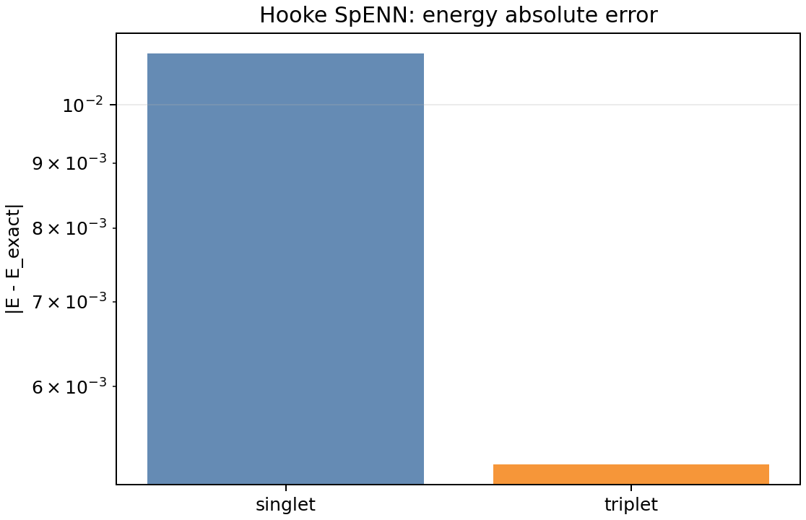
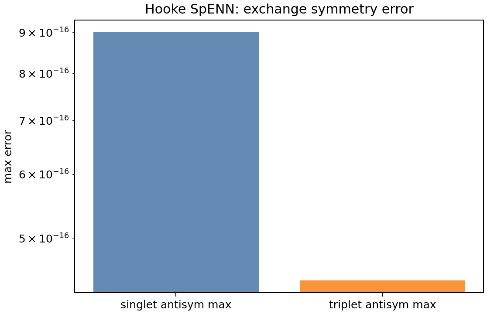
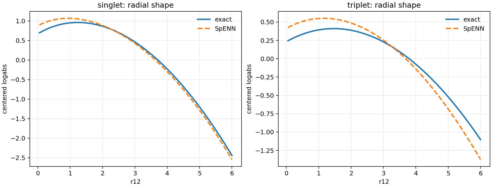
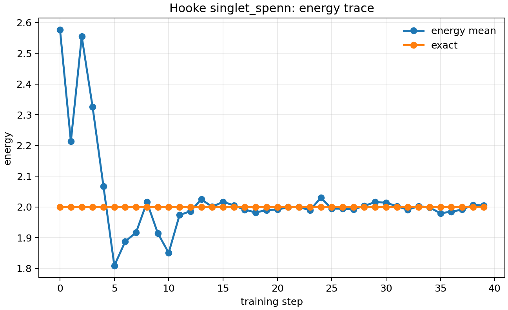
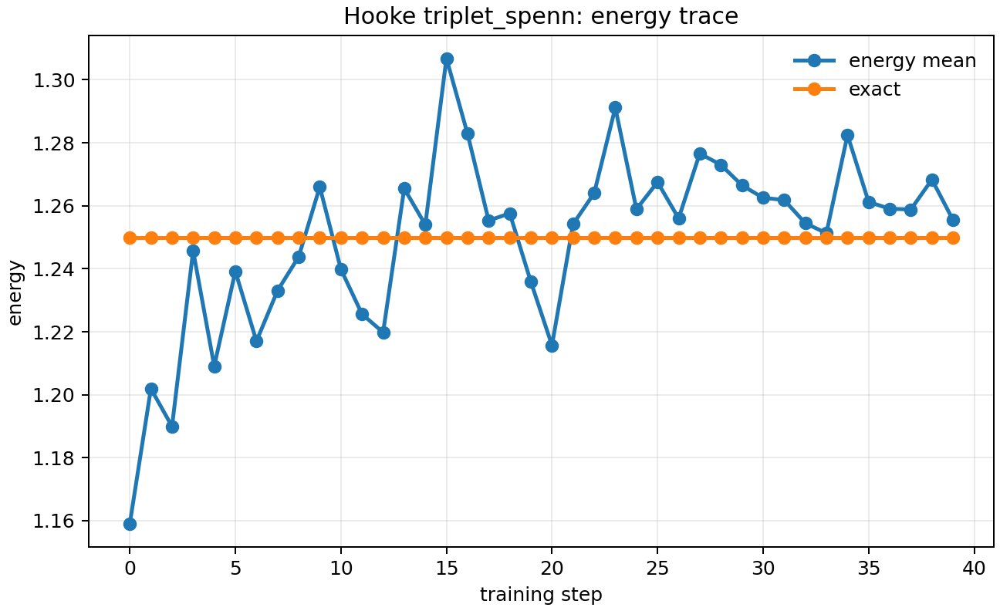

# Hooke Atom Benchmark

This experiment checks the two-electron Hooke atom benchmarks from
`experiments/experiments.typ`: the opposite-spin singlet at `omega = 1/2`
with exact energy `2.0`, and the same-spin triplet at `omega = 1/4` with
exact energy `1.25`.

The exact runs validate the Hamiltonian, cusp behavior, exchange symmetry, and
Metropolis sampler diagnostics. The SpENN runs train small singlet and triplet
models with VMC energy minimization only; analytic solutions are used afterward
as exact-energy references and radial-shape diagnostics, not as training targets.
The learned configs use tanh encoder MLPs, parity-aware SpechtMP message
activations, linear update heads, and residual feature updates.
The Hooke run scripts are data handlers: they load templates from
`experiments/hooke/configs`, apply dotlist overrides with OmegaConf
interpolation, call the generic `train.py` train/evaluate stack, then
read the resulting artifacts. Reusable diagnostics write CSV data;
`plot_outputs.py` owns the Hooke-specific figures.

## Current Report

Generated on 2026-06-01 from the `report_*_20260601` runs:

| run | energy | exact | abs. error | radial RMSE | cusp error | exchange check |
| --- | ---: | ---: | ---: | ---: | ---: | --- |
| exact singlet | 2.000000 | 2.000000 | 0.000000 | n/a | n/a | spatial symmetry |
| exact triplet | 1.250000 | 1.250000 | 0.000000 | n/a | n/a | particle antisym |
| SpENN singlet | 2.010978 | 2.000000 | 0.010978 | 0.091158 | -0.044617 | particle antisym |
| SpENN triplet | 1.255215 | 1.250000 | 0.005215 | 0.139058 | -0.002537 | particle antisym |

The SpENN singlet and triplet configs both use the Pfaffian readout. For SpENN
exchange diagnostics, spins move with particle positions, so the checked model
contract is particle antisymmetry. The exact singlet remains a spatial analytic
reference for energy and radial-shape diagnostics. In both SpENN configs, the
harmonic envelope is configured inside the readout and the cusp is applied last
by `SpENNWavefunction`.











## Reproduce

Run from the repository root:

```bash
uv sync --extra cpu
uv run --extra cpu python experiments/hooke/run_exact.py --config singlet --run-id report_exact_singlet_20260601
uv run --extra cpu python experiments/hooke/run_exact.py --config triplet --run-id report_exact_triplet_20260601
uv run --extra cpu python experiments/hooke/run_spenn.py --config singlet_spenn --run-id report_spenn_singlet_20260601
uv run --extra cpu python experiments/hooke/run_spenn.py --config triplet_spenn --run-id report_spenn_triplet_20260601
uv run --extra cpu python experiments/hooke/plot_outputs.py \
  --singlet-run outputs/2026-06-01/hooke_singlet/report_exact_singlet_20260601 \
  --triplet-run outputs/2026-06-01/hooke_triplet/report_exact_triplet_20260601 \
  --singlet-spenn-run outputs/2026-06-01/hooke_singlet_spenn/report_spenn_singlet_20260601 \
  --triplet-spenn-run outputs/2026-06-01/hooke_triplet_spenn/report_spenn_triplet_20260601
```

Run artifacts are written to `outputs/YYYY-MM-DD/hooke_<sector>/<run_id>/`.
Learned comparisons are written to
`outputs/YYYY-MM-DD/hooke_<sector>_spenn/<run_id>/`.
If rerunning on a later date, update the `2026-06-01` path segment in the
`plot_outputs.py` command, or omit the explicit run paths to plot the latest
available Hooke artifacts.
PNG figures are written to:

```text
experiments/hooke/figures/singlet/
experiments/hooke/figures/triplet/
experiments/hooke/figures/singlet_spenn/
experiments/hooke/figures/triplet_spenn/
experiments/hooke/figures/summary/
```

## Slurm Checks

Reusable cluster smoke checks live in `experiments/hooke/slurm/`.

```bash
sbatch experiments/hooke/slurm/gpu_smoke.job
sbatch experiments/hooke/slurm/cpu_smoke.job
```

The CPU job uses uv's default `.venv` with the `cpu` extra. The GPU job checks
CUDA availability, then runs exact singlet/triplet and tiny SpENN
singlet/triplet Hooke jobs with `device=cuda`; it uses `.venv-gpu` with the
`cu126` extra. Both environments resolve dependencies from the same
`pyproject.toml`, but CPU and CUDA Torch installs do not share a virtual
environment. Logs are written under `experiments/hooke/slurm/logs/`; generated
GPU artifacts go under `outputs/slurm_gpu/`.

Last GPU smoke verification: Slurm job `17941371` completed on 2026-06-01 with
CUDA available on an A100 node. It produced successful exact singlet/triplet and
Pfaffian SpENN singlet/triplet smoke artifacts under
`outputs/slurm_gpu/2026-06-01/`.
