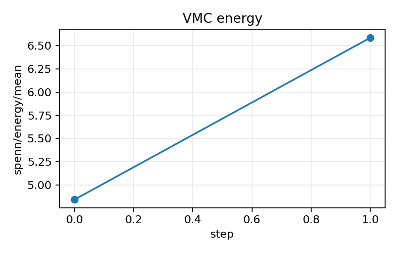
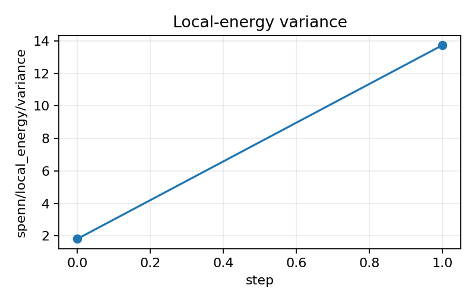
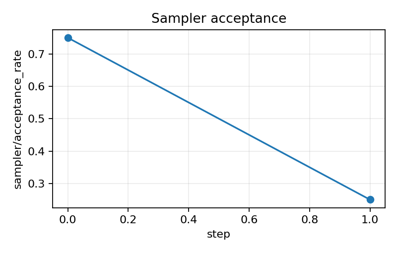
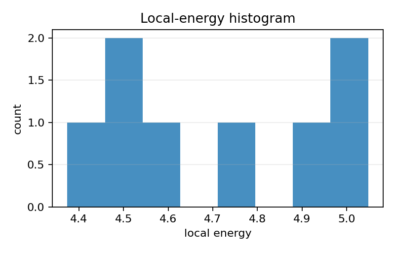
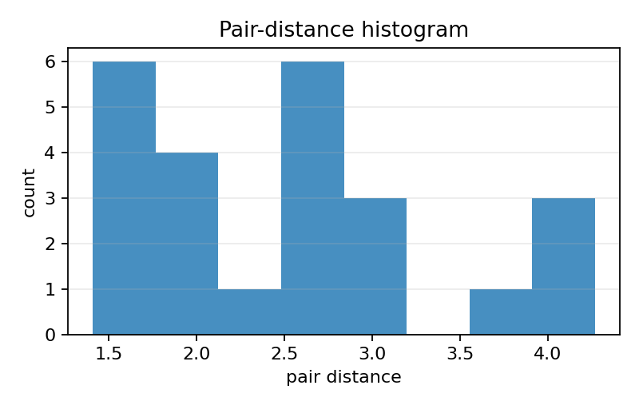
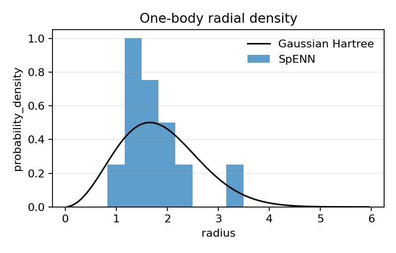
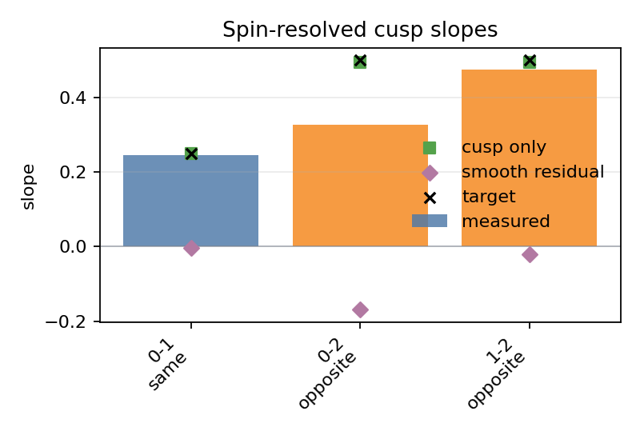
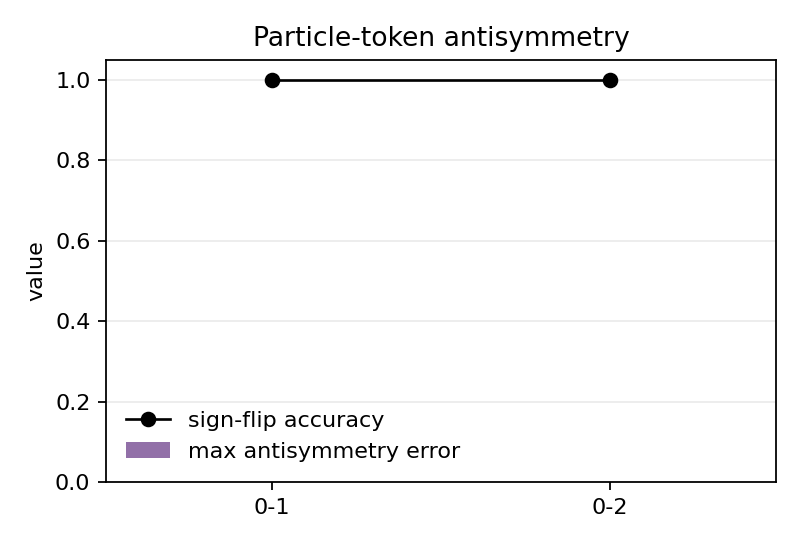
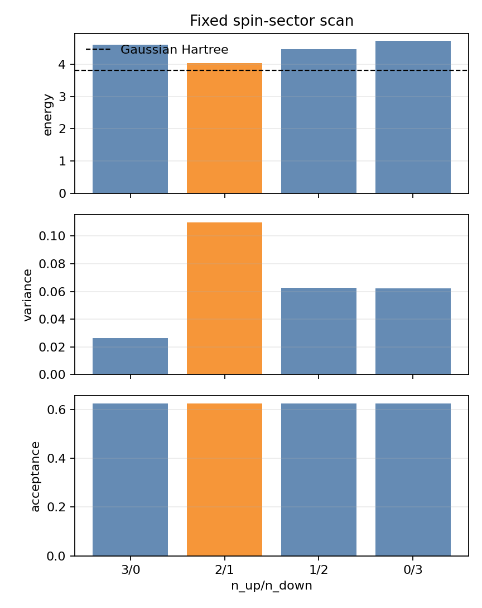

# Hooke Multibody Report

## Purpose

Test whether the SpENN-QMC stack can run a genuinely multielectron Hooke trap
with VMC energy minimization only. The current scaffold targets `N=3`; it is a
VMC-only SpENN launch path, not a supervised exact-reference benchmark.

## Hamiltonian

The system is an `N`-electron harmonic Coulomb trap:

```text
H = sum_i (-1/2 nabla_i^2 + 1/2 omega^2 |r_i|^2) + sum_{i<j} 1 / |r_i-r_j|
```

## Model

The trial form is `psi_theta(R) = exp(J_ee(R)) psi_SpENN(R)`. The configured
cusp slopes are `1/4` for same-spin pairs and `1/2` for opposite-spin pairs.
The initial readout is Pfaffian-based and uses particle-token antisymmetry.
Here a particle token contains both position and spin label, so antisymmetry
checks permute the two together.

## Reference

No numeric multibody reference is configured yet. SpENN is not trained against
any exact or reference wavefunction. Energy tables should be interpreted as VMC
estimates until an independent reference pipeline is added.

## Spin Scan

`run_spenn.py --config benchmark --scan-spins` runs fixed spin sectors from
`configs/benchmark.yaml`, currently `(3, 0)`, `(2, 1)`, `(1, 2)`, and `(0, 3)`.
It trains each sector separately with VMC and records the lowest sampled value
in this smoke scan as the scan best candidate. The scan does not optimize or
mix spin sectors during one run. Scan parents have their own processed CSV/JSON
output and fixed-sector energy/variance/acceptance figure.

## Data and Plots

Run directories are written under `outputs/YYYY-MM-DD/`. Generated configs and
summaries record `run.time` in `HH-MM-SS` format, and generated run ids include
that timestamp. `process_outputs.py` writes processed CSV/JSON under the saved
run directory, while `plot_outputs.py` reads saved metrics and plot CSVs and
writes PNGs under `experiments/hooke_multibody/figures/spenn/`.
Sampler-health outputs include acceptance, proposal scale, pair-distance
summaries, local-energy sample count, autocorrelation time, and effective
sample size when enough sequential production blocks are present.
`energy_plausibility.csv` is the canonical energy table for now. Because no
reference is available, its reference and delta columns are intentionally blank.
Cusp plots report a two-sided direction-averaged full-wavefunction slope, the
analytic cusp-module-only slope, and the residual smooth-factor slope.

## Local Sanity Snapshot

The following local CPU artifacts were generated on 2026-06-03 under
`outputs/codex_hooke_multibody/`. They are smoke-scale checks of the workflow,
not converged VMC evidence.

| run | sector | energy | sem | variance | acceptance |
| --- | --- | ---: | ---: | ---: | ---: |
| `hooke_multibody_spenn_15-23-38_b88e8f03` | `N=3, up=2, down=1` | 4.72118557 | 0.08647394 | 0.05982194 | 0.625 |
| `hooke_multibody_spin_scan_10-03-43_514cbd97_up3_down0` | `N=3, up=3, down=0` | 4.59707710 | 0.08134876 | 0.02647048 | 0.625 |
| `hooke_multibody_spin_scan_10-03-43_514cbd97_up2_down1` | `N=3, up=2, down=1` | 4.03680492 | 0.16581581 | 0.10997953 | 0.625 |
| `hooke_multibody_spin_scan_10-03-43_514cbd97_up1_down2` | `N=3, up=1, down=2` | 4.45998269 | 0.12493563 | 0.06243565 | 0.625 |
| `hooke_multibody_spin_scan_10-03-43_514cbd97_up0_down3` | `N=3, up=0, down=3` | 4.71338838 | 0.12463252 | 0.06213306 | 0.625 |

The smoke run had particle-token antisymmetry error below `6e-16` and sign-flip
accuracy `1.0`. The analytic cusp module itself had small short-range slope
errors (`cusp_only_same_mean_error=-9.49e-4`,
`cusp_only_opposite_mean_error=-5.05e-3`). With the float64 Pfaffian readout
floor lowered to `1e-30`, the two-sided full-wavefunction slope errors were
diagnostic-scale for this smoke run (`same_mean_error=-4.26e-3`,
`opposite_mean_error=-9.94e-2`). The remaining smooth-factor residual slopes
were `-3.31e-3` for the same-spin pair and `-9.43e-2` averaged over
opposite-spin pairs. These are smoke diagnostics, not convergence claims.

## Figure Gallery

Smoke energy trace:



Local-energy variance:



Sampler acceptance:



Local-energy histogram:



Pair-distance histogram:



Radial density:



Spin-resolved cusp slopes:



Particle-token antisymmetry:



Fixed-sector spin scan:



## Slurm

`slurm/cpu_smoke.job` runs the multibody integration smoke test with the `cpu`
uv extra. `slurm/gpu_smoke.job` uses `.venv-gpu`, the `cu126` uv extra, checks
CUDA, and runs the smoke config on `device=cuda`.

As of 2026-06-03, both `sbatch --test-only` and real `sbatch --parsable`
submission attempts failed for the CPU and GPU smoke scripts because the login
node could not contact the Slurm controller. The real submission error was
`sbatch: error: Batch job submission failed: Unable to contact slurm controller
(connect failure)`. The scripts are present, but no controller-backed Slurm
smoke job was accepted from this checkout.

## Known Limitations

The scaffold is intentionally small. Pfaffian evaluation, local-energy second
derivatives, and Specht tuple tensors become expensive quickly as `N`, channel
counts, or Specht order increase.
